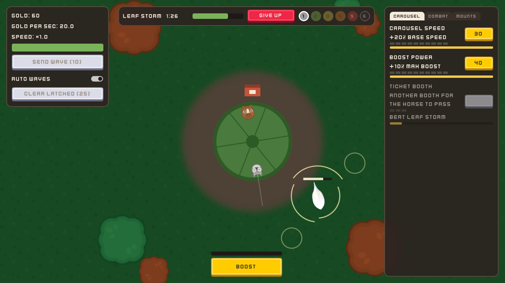

# Devlog #1: Why a carousel?

*Draft by Claude for Garret to edit. Private until published.*

My daughters LOVE carousels. Every fair, every mall, every park: if there's a carousel, we're riding it. So honestly, it was only a matter of time before I tried to make a carousel game haha.

The first attempt wasn't even an idle game. It was a strategy game in the spirit of Slay the Spire and Wildfrost, built around a carousel. I learned a ton working on it in Godot, but the scope was waaaay too big for one person still learning as he went.

So I took a step back and jumped into a game jam to get better at actually *finishing* things. I made a little game about a spinning plate of biscuits, and that's where I fell in love with the spin mechanic. A few months later another jam's theme was literally "spin to win." Come on. That felt like fate :p I didn't finish that one in time, but I had so much fun designing it that I decided to give this a real shot. This time it'd be something I could actually finish and put on Steam.

An idle game fit perfectly. The carousel already spins on its own, so the question became: what if the carousel is the thing you're protecting, and everything you do is about keeping it spinning? A couple of months of planning later, **Idle Carousel** was born!

## Keep it spinning
The carousel sits in the middle of a park. Every turn, your Horse passes the ticket booth and earns Gold. Faster spin = more passes = more Gold. Simple.

But debris blows in from every side: Leaves first, then Sticks, then some heavy Rocks. When something latches onto your carousel, it drags. Let too much pile up and your carousel grinds to a halt.

You fight back two ways:
- **Click** debris to knock it away.
- **Add mounts to the carousel** that do the work for you. The Wolf sweeps everything in its path. The Sloth makes enemies sleepy and slow (my favorite, honestly). The Elephant clears a wide arc. The Panda earns Gold and patches the carousel up.

Early on you're clicking a lot. Later your mounts carry you, and it turns into build decisions instead. Another Horse for more Gold, or a second Wolf before the next boss?

## Tiers and bosses
Debris comes in six color tiers: Grey, Green, Yellow, Orange, Red and Charcoal. Each one's tougher than the last, and each tier ends in a boss fight:
- The **Leaf Storm** swirls around the park flinging whole packs of leaves at you.
- The **Stick Giant** zigzags its way in.
- The **Boulder** grabs on with three separate grips you have to pry off.
- …and three more after that.

Beating a boss unlocks the next tier, new mounts and new upgrades. A first full run should take a few relaxed hours.

## Why carousels, though?
When I looked around (admittedly about a year ago), there just weren't many carousel games out there. And we love carousels. So the dream is to make carousels kind of my thing: a little studio making carousel games in a bunch of different genres, and see where it goes!

## How I'm making it
I'm a solo dev building this in Godot, one of my favorite engines. I use AI coding assistants (Claude Code and Codex) to help write and test the code. Everything you see is either free Kenney art or simple shapes drawn in code from my own designs. No AI-generated art, music, or voice.

## What's next
If this one makes it to Steam and even a handful of people enjoy it, it's back to that first, bigger carousel game!

For now I'm polishing the six bosses and the park's look. Next post: how the park went from a forest to a theme-park plaza (with a couple of wrong turns along the way lol).

Thanks for reading!
