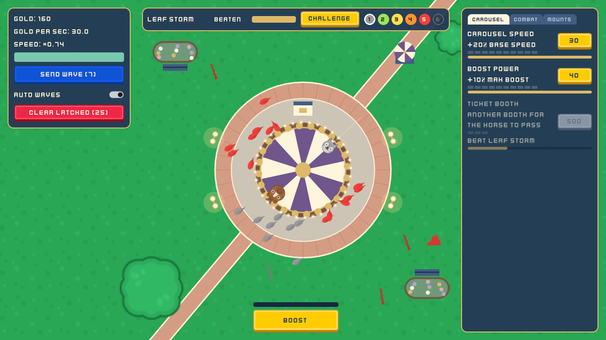
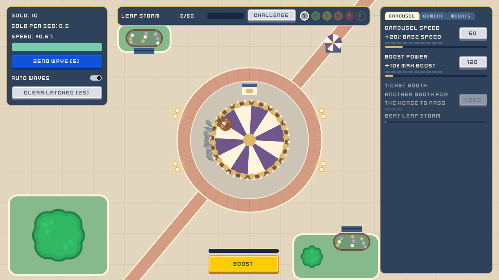
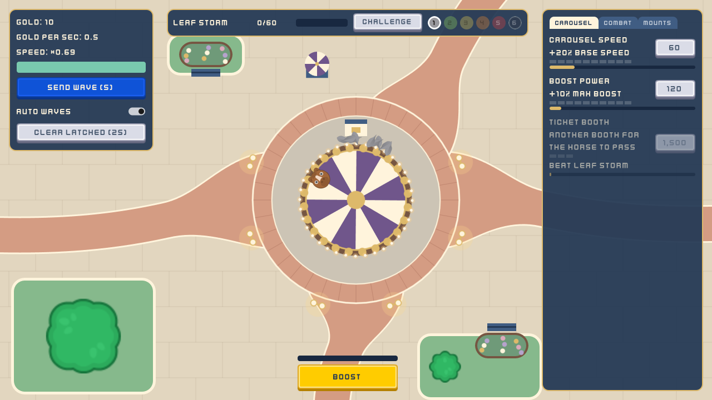
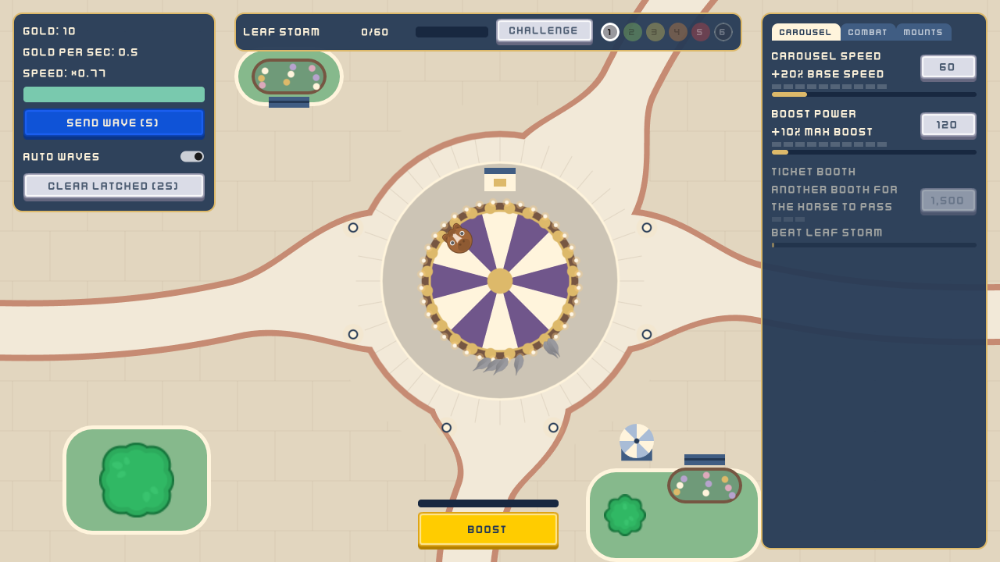
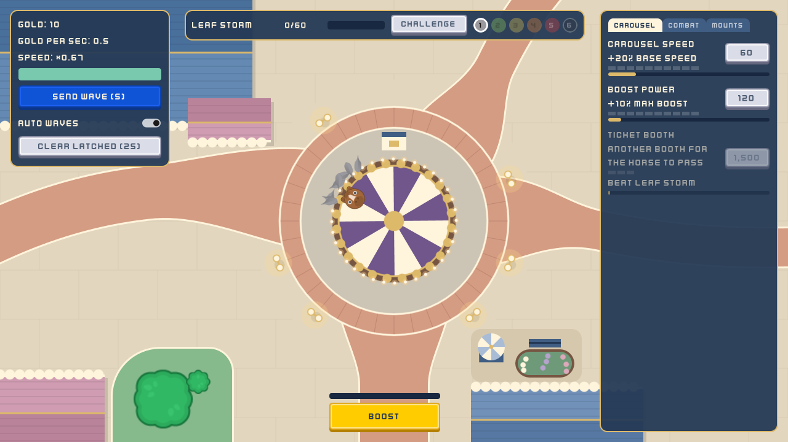
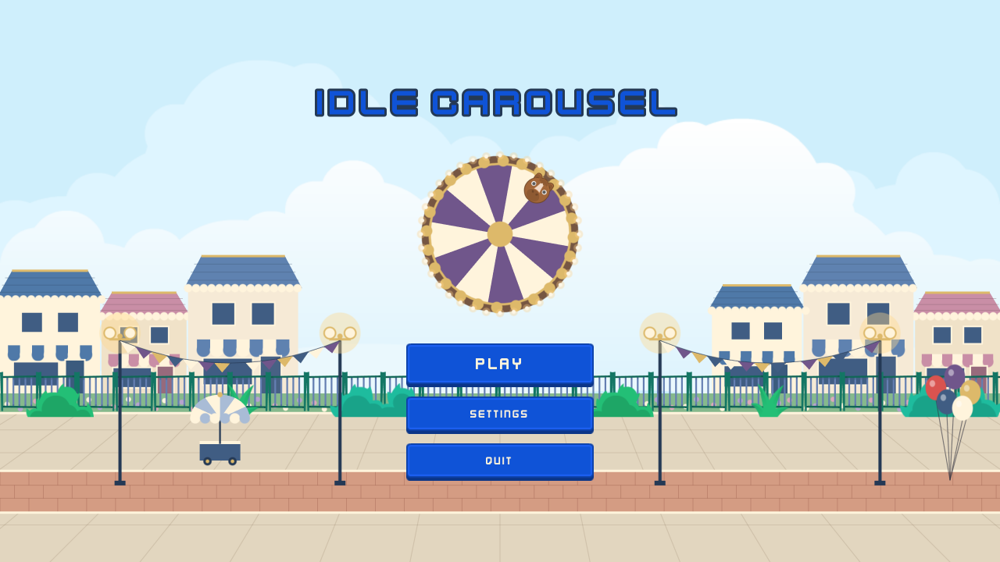
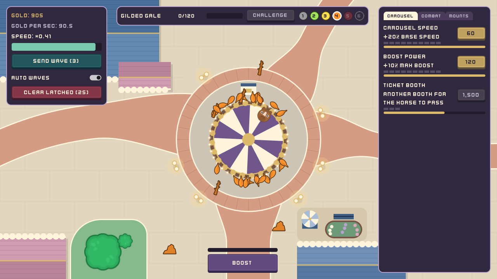

# Devlog #2: From forest to theme park

*Draft by Claude for Garret to edit. Private until published.*

The first version of Idle Carousel's park was… a forest. It worked! But it never felt like somewhere you'd actually find a carousel. This post is about how the park turned into a theme-park plaza in one long day of back and forth, including one change I made and then undid almost right away haha.

## Step 1: a park, not a forest
The first pass swapped the forest for a small, tidy park: a stone plaza, a brick path around the carousel, some flower beds and benches.

Better! But it still felt too much like a lawn with a carousel plopped on it. Carousels live in theme parks, surrounded by pavement, lamps and little shops.

## Step 2: more concrete, less grass
So the grass had to go. Warm concrete slabs cover the ground now, and the only green left lives in curbed planters.

The paths still ran in straight diagonal lines, though, which looked more like a road map than a park. So I pulled up a real theme-park map (can you recognize where? ;)) and looked at how the paths actually leave a carousel: one straight down toward the main attraction, one out to each side, and one heading off at an angle. They curve, and they open up wide where they meet the plaza.

I even sketched the left path's curve right on top of a screenshot so it would bend exactly how I pictured it.

## Step 3: the wrong turn
At one point the walkways went beige to match that map.

Yeah… no lol. It looked washed out, and the brick was honestly half the charm. Back to brick it went! Good reminder that "closer to the reference" isn't always better.

## Step 4: buildings!
The real breakthrough was rooftops. Looking at that map again, what makes the carousel area feel like a *place* isn't the lawns, it's all the buildings around it. So now shop roofs frame the corners (blue and pink with scalloped trim and a little gold ridge), with a big building up in the top left.

The title screen got the same treatment: a row of shopfronts, gold double lamps, a brick promenade and a balloon cart.

## Step 5: color
Last up was color. Every enemy tier now gets an outline in a darker shade of its own color, so even a green Leaf stays easy to spot on green grass. The buttons picked up a palette built around the carousel's purple, and every button that spends Gold is, well, gold.

## What I learned
- **Reference beats imagination.** Looking at a real park map fixed the layout in minutes.
- **Try it, then trust your eyes.** Beige made total sense on paper and looked wrong on screen.
- **Readability first.** Every decoration has to stay out of the way of the stuff you're clicking.

Next time: mounts, and why I'm changing how their upgrades work.

Thanks for reading!
